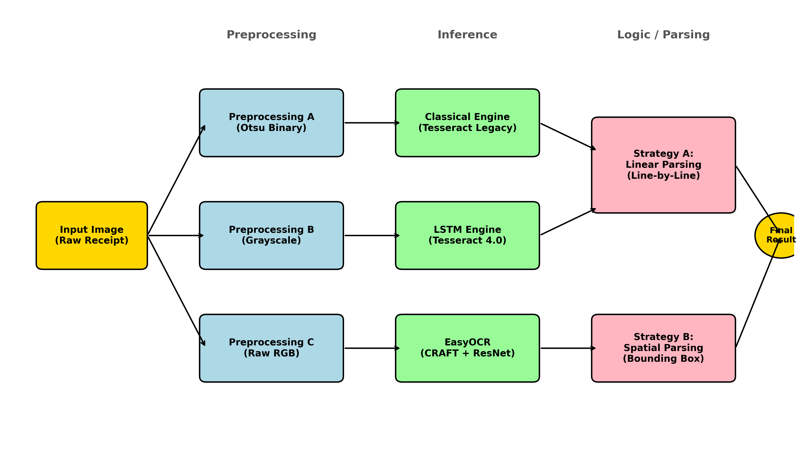
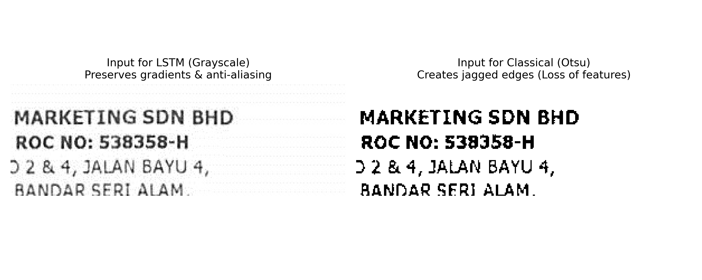
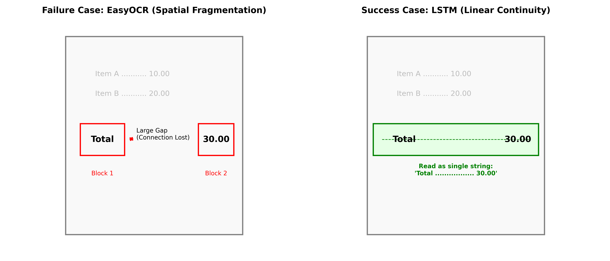
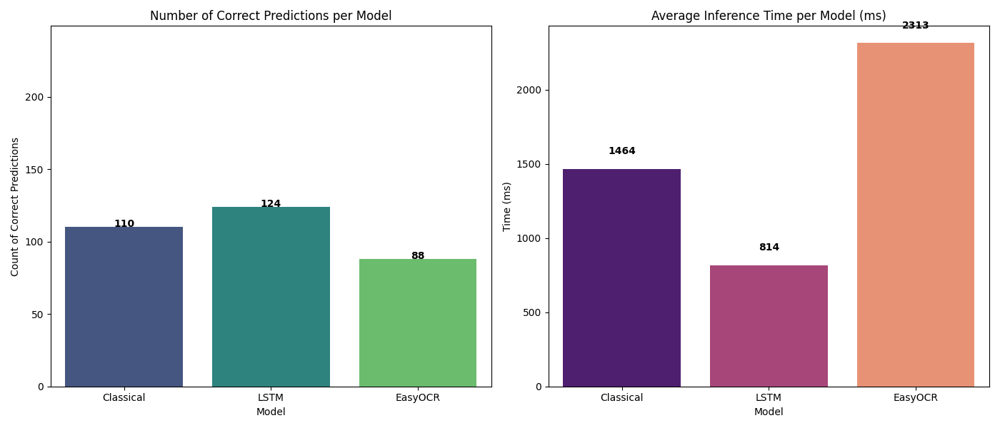

# Automated Receipt Digitization and Expense Extraction

## Introduction

The digitization of physical receipts is a critical component of modern financial automation, enabling streamlined expense management and accounting. However, extracting the "Grand Total" presents significant challenges. Unlike standard scanned documents, receipts are characterized by high variability in layout, thermal ink degradation, and complex background noise like crumpling or shadows.

Traditionally, OCR systems relied on classical techniques like binarization and pattern matching. While efficient, these are brittle against "in-the-wild" noise. This project investigates whether modern deep learning architectures strictly outperform classical methods or if a specialized pipeline is required to prioritize spatial structure over raw character recognition capabilities.

## Data

  * **Source:** Data is sourced from the ICDAR 2019 SROIE challenge.
  * **Composition:** The experimental subset consists of 347 receipt images.
  * **Format:** Each data point includes a raw JPEG scan and a ground truth JSON file containing the manually annotated "Total" amount.
  * **Challenges:** Common artifacts include thermal ink fading, layout variability (different "Total" labels like "RM" or "Grand Total"), and background noise like watermarks or paper folds.

## Methods

A multi-stage computer vision pipeline was developed that tailors preprocessing and extraction logic to the specific strengths of each OCR engine.

### System Overview

The pipeline consists of three modules: Dual-Stream Preprocessing, Multi-Engine OCR Inference, and Heuristic Information Extraction.

<em>Figure 1: The Hybrid Pipeline Architecture</em>

### Preprocessing Evolution

  * **Stream A (Classical):** Subjected to Otsu's Binarization to create solid "blobs" required by the legacy Tesseract engine.
  * **Stream B & C (Deep Learning):** Converted to Grayscale or kept as Raw RGB, preserving anti-aliasing gradients critical for neural networks.

<em>Figure 2: Impact of Binarization on Character Features</em>

### Heuristic Information Extraction

Two distinct parsing algorithms were developed:

  * **Strategy A: Linear Parsing (Tesseract):** Leverages "Linear Continuity" where horizontally aligned text is output as a single string. It uses regex and a scoring system based on keywords like "Total" or "RM".
  * **Strategy B: Spatial Parsing (EasyOCR):** Addresses "Spatial Fragmentation" where the engine breaks a label and price into separate blocks due to whitespace. A "State-Based Look-Ahead Algorithm" scans subsequent text blocks to simulate a spatial link.

<em>Figure 3: Linear Continuity vs. Spatial Fragmentation</em>

## Experiments

The evaluation was performed in a Development Phase ($N=30$) and a Testing Phase ($N=247$).

### Quantitative Benchmarks (Final Results)

The fully optimized pipeline results on the SROIE test set ($N=247$):

| Method | Architecture | Accuracy | Avg. Time | Status |
| :--- | :--- | :--- | :--- | :--- |
| **Classical** | Otsu Binarization + Pattern Matching | 44.5% | 1463 ms | Strong Baseline |
| **Tesseract LSTM**| Recurrent Neural Network (Seq2Seq) | **50.2%**| **814 ms** | **Champion** |
| **EasyOCR** | $ResNet + CRAFT + LSTM + CTC$ | 35.6% | 2313 ms | Underperformer |

<em>Figure 7: Final Accuracy and Speed Benchmark (N=247)</em>

### Analysis of Results

Tesseract LSTM’s scanline-based approach was more effective at preserving the semantic link between labels and values. EasyOCR struggled with over-segmentation, detected disparate text boxes for a single line of information.

## Conclusion

The project demonstrated that Tesseract LSTM is the superior architecture for receipt extraction, balancing accuracy (50.2%) and speed (~814ms). Critically, it was found that a single preprocessing pipeline is insufficient: classical methods require binarization, while neural networks suffer if not provided with raw grayscale/RGB inputs. Future work could integrate lightweight spatial layers like GCNs to handle multi-column layouts without the overhead of massive Transformers.

*For full report please see [Report.pdf](./Report.pdf)*